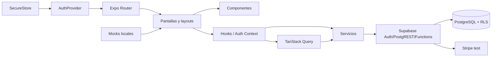

# Arquitectura real de V1

- Fecha: 2026-08-31
- Rama/HEAD: `feature/journey-journal-foundation` / `c302f0e96aa46b9afb26dc4e4f1ccf0cf726068f`
- Alcance: runtime móvil, capas, estado, dependencias y deuda; inspección estática.

## Flujo principal

## Responsabilidades

| Capa | Responsabilidad real |
|---|---|
| Expo Router | rutas filesystem, Stack/Tabs, deep links y `Stack.Protected` |
| `AuthProvider` | hidratar/escuchar sesión, procesar callback, exponer comandos y limpiar cachés al logout |
| SecureStore | persistir sesión Supabase fragmentada en chunks de 1800 caracteres |
| TanStack Query | caché de profile, journal y billing; no duplica sesión |
| Servicios feature | Auth, profile, journal y billing; llamadas directas a Supabase |
| Pantallas | composición, estado UI y navegación; algunas contienen lógica de formulario significativa |
| Mocks | Home, notificaciones y Journey/niveles/ejercicios |
| MMKV | tema y adaptador Zustand; no se encontró store Zustand consumidor |

## Dependencias entre dominios

- Home depende de Auth/Profile reales y de `homeMock` para progreso.
- Notifications depende completamente de `notificationsMock`.
- Journey depende completamente de `journey.mock`; billing de prueba se monta sobre Journey bajo guard dev+flag.
- Journal consulta una vista SQL real mediante React Query.
- Profile puede crear/asegurar perfil desde metadata Auth y actualizarlo.
- SubscriptionScreen lee metadata Auth temporal, no `billing_subscriptions`.

## Hallazgos arquitectónicos

1. No se detectó Supabase directo desde componentes presentacionales; está encapsulado en servicios/provider, salvo que el provider es una capa de dominio válida.
2. No se detectó duplicación de datos remotos en Zustand/MMKV.
3. No se probó automáticamente circularidad; la inspección de imports no mostró ciclos evidentes.
4. `CreateAccountRoute`, `LoginRoute`, `EditProfileScreen`, `CaminoMap` y `AuthProvider` concentran varias responsabilidades y son candidatos a refactor V2.
5. Existen dos representaciones de suscripción: datos legacy/metadata en Profile y billing Stripe autoritativo; hoy no están integradas.
6. `ExercisesScreen` y `SectionScreen` son residuales/placeholder: la tab `ejercicios` actualmente monta `JournalScreen`.
7. `evaluacion-inicial` es una ruta de compatibilidad que solo redirige.
8. `CurrentScreenLabel`, catálogo `src/data/static/*` y adaptador Zustand no muestran consumo principal; revisar antes de eliminar.

## Calidad transversal

`OnboardingBackground` sincroniza contenido con carga/fallo de imagen y cumple la regla de evitar flash blanco. `HomeBackground`, `SectionScreen`, fondo de notificaciones y mapa usan implementaciones independientes; la regla no está aplicada uniformemente a todas las vistas.

## Incertidumbres y pendientes

- No se midieron FPS/memoria de Camino.
- No se ejecutó detector formal de dependencias circulares.
- No se verificaron builds Android/iOS actuales.
- La configuración remota OAuth y RLS autenticado no se puede deducir solo del código.

Referencias: `ROUTES_AND_FLOWS_V1_FINAL.md`, `LOGIC_AND_SERVICES_V1_FINAL.md`, `DATABASE_V1_FINAL.md` y `V2_REUSE_MATRIX.md`.
