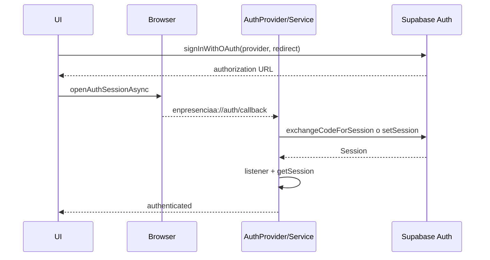

# Autenticación e identidad V1

- Fecha: 2026-08-31
- Rama/HEAD: `feature/journey-journal-foundation` / `c302f0e96aa46b9afb26dc4e4f1ccf0cf726068f`
- Fuentes: cliente, provider, servicio, layouts, rutas y fases Auth/social/profile.

## Implementación

Supabase Auth es fuente de verdad. El cliente usa URL y publishable key; persiste sesión en SecureStore fragmentado, refresca tokens según AppState y desactiva `detectSessionInUrl` para manejar callbacks móviles explícitamente. AuthProvider expone sesión/usuario/status y comandos mediante Context.

`Stack.Protected` separa callback público de tabs/nivel/ejercicio/billing protegidos. Las rutas privadas requieren sesión y `user_metadata.onboarding_completed === true`; Empezar requiere sesión y establece esa metadata.

## Matriz de proveedores

| Proveedor | Código/UI | Configuración | Validación | Dependencia/pendiente |
|---|---|---|---|---|
| Email/password | signup, login, resend y confirm email | Supabase reportado | usuario pudo registrar/login: reportado | recuperación de contraseña ausente; matriz completa pendiente |
| Google | OAuth browser + callback | Supabase/Google reportado | éxito reportado históricamente | repetir app fría/abierta en build actual |
| Facebook | OAuth browser + callback | Meta/Supabase externo | propietario reportó auth y sesión guardada tras reabrir; no reproducido | retorno inmediato históricamente regresaba al video; políticas Meta externas |
| Apple | logo existe, no habilitado; tipo no soportado por servicio | no | no | membresía Apple/iOS y diseño futuro |

## Callback y ciclo de sesión

El servicio deduplica callbacks por URL/promesa porque route y provider pueden ver el mismo code. En apertura fría, AuthProvider revisa `Linking.getInitialURL`; en app abierta usa `useLinkingURL`. Si el procesamiento falla, intenta conservar una sesión ya persistida.

## Perfil e identidad

`auth.users` conserva identidad, email, providers y metadata. `public.profiles` comparte UUID y contiene datos editables. El trigger crea/backfill profile; `ensureProfile` cubre faltantes desde metadata. UI normaliza allowlist de metadata, prioriza profile y usa Auth como fallback.

Onboarding vive en `user_metadata`, no en profile. SubscriptionScreen usa metadata no autoritativa (`subscription_type`, `card_last4`, `subscription_expires_at`), separada del billing Stripe.

## Logout y caché

Al evento `SIGNED_OUT` se eliminan queries profile, journal y billing. No se limpian mocks porque son estáticos. No se reprodujo aislamiento visual tras cambio rápido entre dos cuentas.

## Riesgos

- `NSAllowsArbitraryLoads` debilita transporte iOS.
- Redirect usa custom scheme, no Universal Link/App Link.
- El acceso V1 exige login antes de tabs; esto contradice el requisito futuro de invitado V2.
- Actualizar profile y email no es atómico.
- Configuración real de providers vive fuera de Git y no fue auditada desde dashboards.
- La fase social histórica está desactualizada respecto al código: Facebook sí está habilitado; Apple sigue pendiente.

Referencias: `ROUTES_AND_FLOWS_V1_FINAL.md`, `DATABASE_V1_FINAL.md`, fases archivadas 01–03 y fast-fixes.
