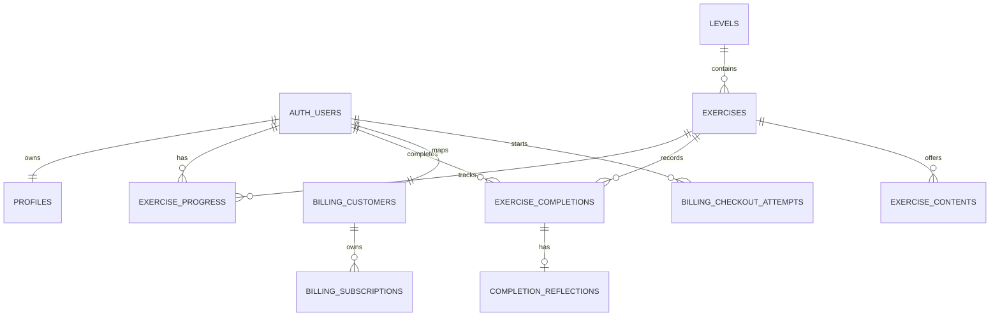

# Base de datos y modelos V1

- Fecha: 2026-08-31
- Rama/HEAD: `feature/journey-journal-foundation` / `c302f0e96aa46b9afb26dc4e4f1ccf0cf726068f`
- Fuentes: cuatro migraciones, `database.ts`, queries, Functions y consultas remotas anónimas.
- Estado remoto: existencia corroborada indirectamente por respuestas PostgreSQL; aplicación detallada/versión no comparada con `db diff`.

## Diagrama ER

`stripe_webhook_events` es auditoría independiente por `stripe_event_id`. `journal_entries` es una vista UNION de progress parcial y completions.

## Diccionario resumido

| Relación | PK/FK y campos esenciales | Restricciones/índices |
|---|---|---|
| `profiles` | `id` PK/FK auth; name, DOB, phone, language, avatar, timestamps | longitud/fecha/locale; trigger updated; trigger auth backfill |
| `levels` | UUID PK; number, name, description, publication, premium | number unique; publication check |
| `exercises` | UUID PK; level FK; name, content_type, position, description, duration, publication | unique level/name y level/position |
| `exercise_progress` | PK user+exercise; %, last activity | 0..100; índices actividad/% |
| `exercise_completions` | UUID PK; user/exercise FKs; idempotency, repetition, duration, emotional score | unique user/idempotency y repetition; score 1..5 |
| `exercise_contents` | UUID PK; exercise FK; modality/locale/storage/text/mime/publication | payload según modalidad; unique modality/locale; private storage |
| `completion_reflections` | completion PK/FK; text/timestamps | texto 1..5000 |
| `billing_customers` | user PK/FK; provider; Stripe customer | customer unique y formato `cus_` |
| `billing_subscriptions` | UUID PK; user FK; Stripe IDs/status/periodos | IDs unique, status limitado, event timestamp |
| `billing_checkout_attempts` | attempt UUID PK; user FK; session/status/expiry | una creating/open por user; formato `cs_` |
| `stripe_webhook_events` | event PK; type/time/status/error | dedupe; status check; índice status/time |

## RPC, triggers y Storage

- `complete_exercise`: inserción idempotente, repetición serializada y progress=100.
- `claim_stripe_webhook_event`: dedupe/reintento solo de failed.
- `sync_stripe_subscription`: upsert autoritativo que no retrocede ante evento más antiguo.
- Triggers `set_*_updated_at` y creación/backfill de profile tras auth user.
- Bucket privado `exercise-content`; policy de lectura solo para contenido publicado.

## Matriz RLS/grants

| Relación | anon | authenticated | Backend/service role |
|---|---|---|---|
| profiles | sin acceso | CRUD propio: select/insert/update | all |
| levels/exercises | sin acceso | select global (migración base) | all |
| progress | sin acceso | select/insert/update propio | all |
| completions | sin acceso | select propio; completar por RPC | all |
| exercise_contents | sin acceso | select publicado con padres publicados | all |
| reflections | sin acceso | select/insert/update si completion propio | all |
| journal_entries | sin acceso | select; seguridad invoker hereda RLS | n/a |
| billing customer/subscription | sin acceso | select propio | all |
| checkout attempts/events | sin acceso | sin grants | all |

Prueba 2026-08-31: las 12 relaciones consultadas sin sesión respondieron `401/42501 permission denied`. Esto valida no exposición anónima, no aislamiento entre usuarios.

## Tipos y queries reales

`src/types/database.ts` modela profiles, journal view, billing tables y RPC. No modela de forma completa `levels`, `exercises`, progress, completions, contents o reflections pese a que existen en SQL: brecha de tipos.

Queries consumidas por app: profiles SELECT/UPSERT/UPDATE; journal view SELECT/filter/order/range; billing subscription SELECT; Function invoke. Journey y detalle de ejercicio no consultan catálogo. Functions usan billing CRUD/RPC.

## Planeado/inexistente

No existe tabla de entitlements, planes comerciales, notificaciones, racha, comunidad/eventos, asignaciones diarias ni emoción/reflexión inicial separada. “Puertas” solo existe como lenguaje UI/mock. No se encontró bucket de avatars creado por migración.

## Incertidumbres/riesgos

- No se ejecutó `supabase db diff` ni RLS con dos usuarios.
- No se confirmó seed/catálogo remoto ni contenido publicado.
- Escrituras directas a progress y timestamp de completions requieren endurecimiento.
- Tipos manuales pueden divergir.
- La migración billing fue reportada aplicada y sus tablas existen; no se probó service role/RPC remoto.

Referencias: `EXERCISES_AND_PROGRESS_V1_FINAL.md`, `PAYMENTS_V1_FINAL.md`, fases 05 y Stripe archivadas.
