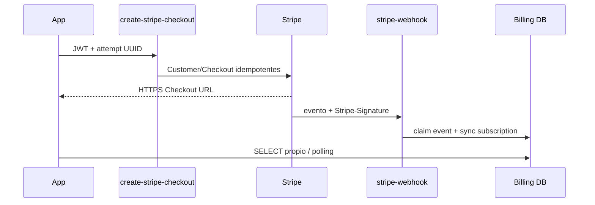

# Pagos y suscripción V1

- Fecha: 2026-08-31
- Rama/HEAD: `feature/journey-journal-foundation` / `c302f0e96aa46b9afb26dc4e4f1ccf0cf726068f`
- Alcance: código local, migración, pruebas, consultas y estado remoto de Functions.

## Arquitectura implementada

## Estado real

| Elemento | Estado/evidencia |
|---|---|
| Product/Price test | creado y Price ID reportado por propietario; valor no archivado |
| Secret key/Price secret | configurados: reportado; valores no leídos |
| Migración billing | aplicada: reportado; cuatro tablas existen y niegan anon |
| Checkout Function | código y despliegue remoto `ACTIVE` v1, JWT=true |
| Webhook Function | código y despliegue remoto `ACTIVE` v1, JWT=false |
| Firma webhook | implementación usa raw body + signing secret; secreto/endpoint final no confirmado después del cambio de tarea |
| App | feature, servicio, hooks, botón dev+flag y retorno implementados |
| Retorno HTTPS | pendiente; no hay dominio/página bridge |
| E2E | no ejecutado |
| Entitlements | inexistentes; no desbloquea contenido |

Smoke remotos: POST webhook sin firma → `400 SIGNATURE_REQUIRED`; Checkout sin bearer → `401 AUTH_REQUIRED`. Son pruebas negativas, no demuestran comunicación Stripe ni persistencia.

## Seguridad

- App no recibe price/monto/moneda ni claves Stripe.
- Price y URLs son configuración servidor.
- Customer se reutiliza por user y metadata mínima.
- Attempt e idempotency Stripe reducen doble submit.
- Webhook deduplica `event.id`, valida status y evita retroceso temporal.
- Billing customer/subscription solo se leen por propietario; attempts/events son backend-only.
- Botón requiere `__DEV__ && EXPO_PUBLIC_ENABLE_STRIPE_TEST_CHECKOUT` y flag default false.

## Contradicciones/residuos

El README histórico Stripe dice “sin despliegues remotos”, pero el log y la CLI remota confirman ambas Functions activas. `SubscriptionScreen` no consume billing y continúa mostrando metadata Auth simulada. No existe portal, cancelación, refunds, IAP ni catálogo comercial.

## Bloqueos

1. Crear puente HTTPS estable y configurar success/cancel.
2. Confirmar webhook destination test y `STRIPE_WEBHOOK_SECRET` sin exponerlo.
3. Completar Checkout test, evento firmado y estado DB.
4. Probar app abierta/fría, cancelación, retries, dos usuarios y RLS.
5. Resolver cumplimiento de compras digitales antes de producción móvil.

No continuar Stripe durante el cierre V1. Referencias: fases Stripe archivadas, `DATABASE_V1_FINAL.md`, `VALIDATION_V1_FINAL.md`.
