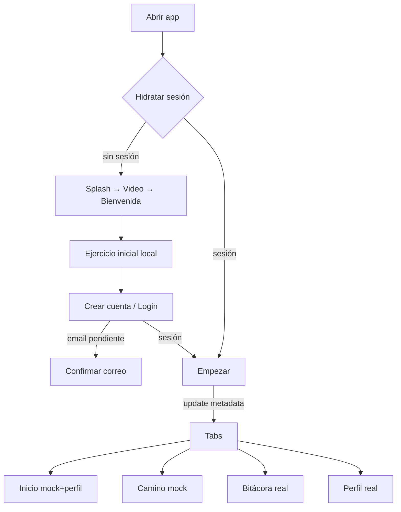

# Rutas y flujos de V1

- Fecha: 2026-08-31
- Rama/HEAD: `feature/journey-journal-foundation` / `c302f0e96aa46b9afb26dc4e4f1ccf0cf726068f`
- Fuente: `src/app`, layouts, navegación emitida y AuthProvider.

## Inventario de rutas

| Ruta | Archivo / origen | Acceso y requisito | Datos / estado |
|---|---|---|---|
| `/` | `app/index.tsx` | pública | decide Empezar, callback o splash por sesión/URL |
| `/onboarding/splash` | `splash.tsx` | sin sesión | fondo estático; timeout a video |
| `/onboarding/video` | `video.tsx` | sin sesión | fondo + MP4 genérico; sin regresar |
| `/onboarding/bienvenida` | `bienvenida.tsx` | sin sesión | navegación local |
| `/onboarding/ejercicio-inicial` | `ejercicio-inicial.tsx` | sin sesión | MP4 + emoción local; no persiste |
| `/onboarding/evaluacion-inicial` | `evaluacion-inicial.tsx` | sin sesión | redirect legacy |
| `/onboarding/poder-del-cambio` | `poder-del-cambio.tsx` | sin sesión | navegación local |
| `/onboarding/crear-cuenta` | `crear-cuenta.tsx` | sin sesión | Supabase signup/OAuth; modal email |
| `/onboarding/login` | `login.tsx` | sin sesión | Supabase email/Google/Facebook; recuperación TODO |
| `/onboarding/empezar` | `empezar.tsx` | sesión | escribe `onboarding_completed`; entra a tabs |
| `/auth/callback` | `auth/callback.tsx` | guard sin sesión | procesa code/tokens/error; coordinación duplicada con provider |
| `/(tabs)` | layout Tabs | sesión + onboarding | Inicio, Camino, Bitácora, Para Ti, Yo |
| `/(tabs)/index` | HomeScreen | protegida | profile real + home mock |
| `/(tabs)/camino` | JourneyScreen | protegida | Journey mock + botón Stripe dev/flag |
| `/(tabs)/ejercicios` | JournalScreen | protegida | vista `journal_entries` real |
| `/(tabs)/para-ti` | ForYouScreen | protegida | placeholder |
| `/(tabs)/yo` | ProfileScreen | protegida | Auth/Profile real + opciones futuras |
| `/(tabs)/yo/editar-perfil` | EditProfileScreen | protegida | Profile y Auth email; éxito parcial posible |
| `/(tabs)/yo/suscripcion` | SubscriptionScreen | protegida | metadata temporal, no billing autoritativo |
| `/(tabs)/notificaciones` | NotificationsScreen | oculta en tab | mock; accesible desde Home/Yo |
| `/(tabs)/auth-inspector` | inspector | oculta; dev | usuario Auth sanitizado |
| `/camino/nivel/[levelId]` | LevelScreen | protegida | nivel/ejercicios mock |
| `/exercise/[exerciseId]` | placeholder inline | protegida | solo muestra ID |
| `/billing/return?result=` | retorno Stripe | protegida | consulta/polling billing; URL web pendiente |
| `+not-found` | fallback | pública | texto en inglés y enlace `/` |

## Flujos

### OAuth

`signInWithOAuth` abre `openAuthSessionAsync`, espera `enpresenciaa://auth/callback`, intercambia code o fija tokens y AuthProvider vuelve a leer sesión. AuthProvider también escucha URL inicial/activa y deduplica por URL/promesa. Google está reportado como probado; Facebook tuvo retorno al onboarding hasta reabrir en pruebas históricas y no se reprodujo en este cierre; Apple no está implementado.

### Logout

Supabase cierra sesión; el listener elimina queries `profile`, `journal` y `billing-subscription`; guards desmontan rutas privadas. No hay prueba funcional reciente de cambio rápido entre usuarios.

### Camino/ejercicio

El usuario abre un nodo permitido por status mock, entra a una lista mock y puede navegar a un detalle placeholder. No existe operación UI que complete ejercicio, guarde emoción/reflexión o actualice progreso; el flujo de dominio es imposible de completar.

### Pagos

El botón solo aparece con `__DEV__` y flag. La app solicita una URL HTTPS a la Function y abre navegador. El retorno consulta estado webhook; falta URL HTTPS y webhook firmado verificado, por lo que el flujo E2E no es completables hoy.

## Riesgos

- La regla actual siempre envía una sesión a Empezar desde `/`, incluso si onboarding ya estaba completo; los guards protegen tabs pero no optimizan este reingreso.
- Callback se procesa en ruta y provider; existe deduplicación, pero aumenta complejidad.
- La pantalla billing puede hacer polling indefinido si nunca llega estado confirmado.
- Botón “Olvidaste tu contraseña” no tiene acción.

Referencias: `AUTH_V1_FINAL.md`, `EXERCISES_AND_PROGRESS_V1_FINAL.md`, `PAYMENTS_V1_FINAL.md`.
