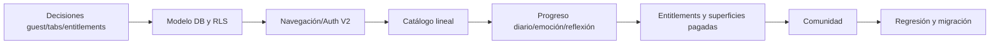

# Requisitos preliminares para V2

- Fecha: 2026-08-31
- Rama/HEAD de origen: `feature/journey-journal-foundation` / `c302f0e96aa46b9afb26dc4e4f1ccf0cf726068f`
- Estado: requisitos futuros; **ninguno debe interpretarse como funcionalidad V1 existente**.

## Producto

1. Eliminar racha.
2. Eliminar notificaciones invasivas.
3. Permitir acceso a tabs después del ejercicio inicial y Empezar sin login obligatorio.
4. Sustituir montaña por camino lineal de ejercicios.
5. Mantener niveles internos sin seccionar visualmente el camino.
6. Cargar ejercicios disponibles desde base de datos.
7. Limitar ejercicio principal a uno por día.
8. Guardar emoción y reflexión.
9. Usar Comunidad para eventos, reuniones y avisos.
10. Convertir Bitácora en funcionalidad de pago.
11. Bloquear mediante suscripción Basta, Para Ti y Bitácora.
12. Evaluar nueva estructura de tabs.
13. Mantener Perfil y configuración.

## Decisiones técnicas necesarias antes de implementar

| Tema | Pregunta obligatoria |
|---|---|
| Invitado | ¿Supabase anonymous auth, identidad local migrable u otro modelo? |
| RLS | ¿Cómo accede invitado a catálogo y cómo se apropian datos al registrarse? |
| Progreso diario | zona horaria, definición de día, reintentos y quién impone el límite |
| Entitlements | tabla/servicio autoritativo, productos y restauración multiplataforma |
| Tabs | nombres, orden, rutas públicas y bloqueadas |
| “Basta” | alcance exacto; el término no existe en V1 |
| Comunidad | modelo editorial, roles, calendario y notificaciones opt-in |
| Emoción/reflexión | cuándo se captura, privacidad, edición y retención |
| Catálogo | publicación, asignación, versión, contenido y offline |
| Pagos | web vs IAP por plataforma/región y cumplimiento store |

## Restricciones de migración

- No borrar datos V1 sin plan/backup.
- No reescribir migraciones remotas aplicadas; usar nuevas versiones.
- Diseñar migración de usuarios existentes y estado onboarding.
- Mantener completions idempotentes y billing autoritativo por webhook.
- Separar entitlement de status Stripe.
- Sustituir mocks por repositorios/queries con fixtures de prueba.
- Definir telemetría, errores y matrices Android/iOS antes de declarar paridad.

## Secuencia propuesta

## Fuera de este cierre

No se crearon rutas, tablas, componentes ni migraciones V2. Este documento es entrada de diseño y requiere confirmación del propietario.
